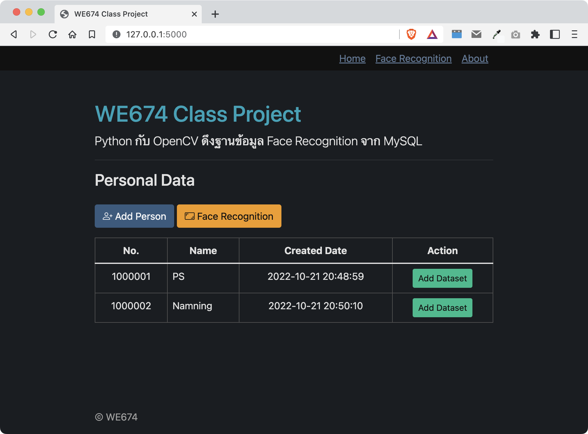

# WE674 Class Project

## Python กับ OpenCV ดึงฐานข้อมูล Face Recognition จาก MySQL
<br />



### วิธีติดตั้ง
1. สร้างฐานข้อมูลใน MySQL ชื่อ we674_db แล้ว import ไฟล์ we674_db.sql เข้าไป
2. แก้ไข database connection ให้ถูกต้อง เช่น ชื่อผู้ใช้ รหัสผ่านฐานข้อมูล
3. ติดตั้ง library ที่จำเป็นต้องใช้งาน ดังนี้
    * ```pip install flask```
    * ```pip install mysql-connector```
    * ```pip install opencv-python```
    * ```pip install Pillow```
    * ```pip install numpy```
    * ```pip install playsound```
4. สร้าง folder ชื่อ ```dataset``` ไว้ที่เดียวกับไฟล์ app.py
5. สั่ง run โดยคลิกปุ่ม run หรือผ่าน command ```python3 app.py```
6. หากไม่พบข้อผิดพลาด ก็สามารถเปิดเข้าไปที่ http://127.0.0.1:5000 เพื่อใช้งานได้เลย
<br />
<br />

### ลิงก์ที่เกี่ยวข้อง
* mysql ผมใช้ตัวที่มากับ [xampp](https://www.apachefriends.org/download.html) ผ่าน phpmyadmin
* [Flask](https://pypi.org/project/Flask/)
* [opencv-python](https://pypi.org/project/opencv-python/)
* [Pillow](https://pypi.org/project/Pillow/)
* [numpy](https://pypi.org/project/numpy/)
* [playsound](https://pypi.org/project/playsound/)